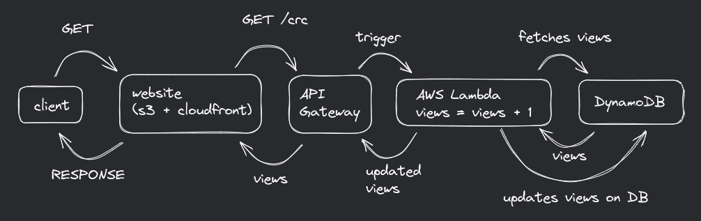

# Cloud Resume Challenge

Built static website using AWS services. Used S3 buckets, IAM roles/policies, Lambda function, DynamoDB table, API Gateway, Cloudfront Distribution, Route53 configuration, ACM Certificate setup, Terraform Infrastructure as Code (IaC).

To test the lambda function:
```bash
# dependencies
pip install moto boto3 pytest

# testing lambda
pytest src/backend
```

To deploy IaC:
```bash
cd terraform

terraform init 
terraform apply
```

Required Environment Variables:
```bash
AWS_ACCESS_KEY_ID
AWS_SECRET_ACCESS_KEY
AWS_DEFAULT_REGION

TF_VAR_FRONTEND_DOMAIN_NAME
TF_VAR_ZONE_ID_LIVE # zone id of hosted zone
TF_VAR_ACM_CERT_ARN # cert arn

TF_VAR_BACKEND_DOMAIN_NAME
TF_VAR_ZONE_ID_SITE # zone id of hosted zone
TF_VAR_CERT_ARN # cert arn
```

## Working

